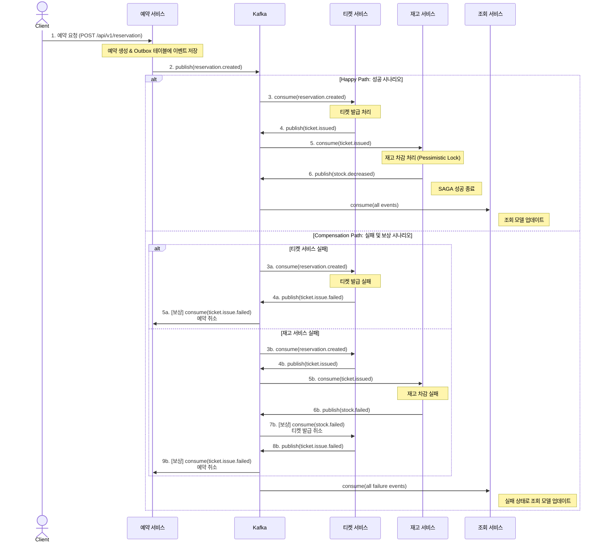

# MSA 기반 티켓팅 시스템 (Saga Pattern & Kafka)

본 프로젝트는 이벤트 소싱, CQRS, Saga 패턴(Choreography-based)을 활용하여 MSA(마이크로서비스 아키텍처) 환경에서 서비스 간 데이터 정합성을 유지하는 방법을 실험하는 예제 프로젝트입니다.

## 핵심 기술 스택 (Core Technologies)

* **Language**: Java 17+
* **Framework**: Spring Boot 3.x
* **Messaging**: Apache Kafka
* **Database**: MySQL, Redis
* **Architecture**: Microservice Architecture, Event Sourcing, CQRS, Saga Pattern
* **API**: Spring Cloud Gateway, OpenFeign
* **Service Discovery**: Eureka
* **ORM**: Spring Data JPA

 

## 아키텍처 개요 (Architecture Overview)

이 프로젝트는 여러 개의 독립적인 마이크로 서비스로 구성되어 있습니다.

* **API Gateway (`api-service`)**: 모든 클라이언트 요청의 진입점 역할을 하며, 각 요청을 적절한 서비스로 라우팅합니다.
* **Service Discovery (`discovery-service`)**: 서비스 등록 및 검색을 위해 Eureka를 사용합니다.
* **Command & Query Services**: CQRS 패턴에 따라 명령(Command)과 조회(Query) 책임이 분리되어 있습니다.
    * **Command Services**: `reservation-service`, `ticket-service`, `stock-service`는 시스템의 상태를 변경하는 역할을 담당합니다.
    * **Query Service (`query-service`)**: 다른 서비스에서 발행된 이벤트를 구독하여 조회에 최적화된 데이터 모델(Read Model)을 구축하고 유지합니다.

 

## 핵심 워크플로우: Saga 패턴 기반 예약 처리 (Core Workflow: Reservation Process with Saga Pattern)

핵심 비즈니스 로직인 '예약 생성' 과정은 코레오그래피 기반 Saga 패턴(Choreography-based Saga)으로 구현되었습니다. 각 서비스는 Kafka를 통해 이벤트를 발행(Publish)하고, 다른 서비스들은 이 이벤트를 구독(Consume)하여 자신의 작업을 수행합니다. 만약 특정 단계에서 실패할 경우, 보상 트랜잭션(Compensation Transaction)을 통해 이전 작업을 취소하여 데이터 정합성을 유지합니다.

## 서비스 상세 (Service Details)
| Service                 | Port | Description                                                                                                                                                                                                                                                                                                                        |
| ----------------------- | :--- | ---------------------------------------------------------------------------------------------------------------------------------------------------------------------------------------------------------------------------------------------------------------------------------------------------------------------------------- |
| **`discovery-service`** | 8761 | MSA 환경의 서비스들을 등록하고 검색할 수 있는 Eureka 서버입니다.                                                                                                                                                                                                                                                                  |
| **`api-service`** | 8080 | Spring Cloud Gateway를 사용하여 모든 API 요청을 관리하는 진입점입니다.                                                                                                                                                                                                                                                               |
| **`reservation-service`** | 8081 | 사용자의 예약 요청을 처리합니다. **Outbox Pattern**을 사용하여 예약 생성 트랜잭션과 `reservation.created` 이벤트 발행을 원자적으로 보장합니다. 또한, 후속 Saga 실패 시 보상 이벤트를 구독하여 예약을 취소합니다.                                                                                                            |
| **`ticket-service`** | 8082 | `reservation.created` 이벤트를 구독하여 티켓 발급을 처리하고, 성공/실패 여부에 따라 `ticket.issued` 또는 `ticket.issue.failed` 이벤트를 발행합니다. 재고 부족 시 `stock.failed` 이벤트를 받아 티켓 발급을 취소하는 보상 로직을 수행합니다.                                                                                             |
| **`stock-service`** | 8083 | `ticket.issued` 이벤트를 구독하여 티켓 재고를 감소시킵니다. 동시성 제어를 위해 **비관적 락(Pessimistic Lock)**을 사용합니다. 재고 차감 실패 시 `stock.failed` 이벤트를 발행하여 Saga 롤백을 시작합니다.                                                                                                                            |
| **`query-service`** | 8084 | Saga 과정에서 발생하는 모든 이벤트(`reservation.created`, `ticket.issued`, `stock.decreased` 및 모든 실패/보상 이벤트)를 구독하여 **조회 전용 데이터 모델(`ReservationDetails`)**을 생성하고 업데이트합니다. |
